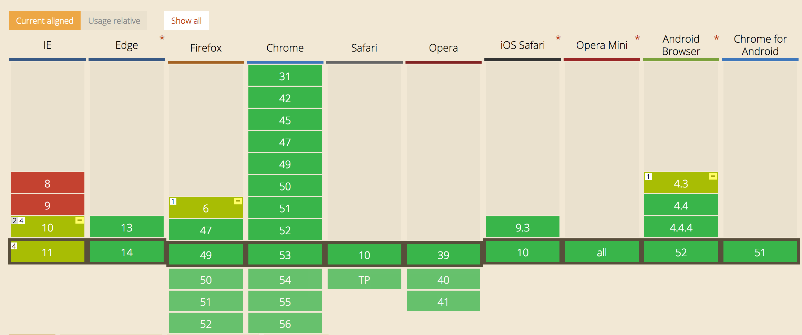

###  Flex 理解与分享

##### 相关资料：

1. <http://www.ruanyifeng.com/blog/2015/07/flex-grammar.html>
2. <http://www.runoob.com/w3cnote/flex-grammar.html>
3. <https://developer.mozilla.org/zh-CN/docs/Web/CSS/flex>
4. <https://www.cnblogs.com/nuannuan7362/p/5823381.html>
5. <http://www.ruanyifeng.com/blog/2015/07/flex-examples.html>
6. <http://blog.csdn.net/magneto7/article/details/70854472>

##### 什么是 Flex

​        Flex 是 Flexible Box 的缩写，意为"弹性布局"，与传统布局，基于盒模型，用 display + position + float 来布局相比，flex 布局更加灵活，可响应式。需要注意的是，使用了flex布局，元素的 float, clear, vertical-align 属性将会失效。

​        容器默认存在两根轴：水平的主轴（ main axis）和垂直的交叉轴（ cross axis ）。主轴的开始位置（与边框的交叉点）叫做 main start，结束位置叫做 main end；交叉轴的开始位置叫做 cross start，结束位置叫做 cross end。项目默认沿主轴排列。

##### Flex 兼容性

##### Flex 容器的属性

1. flex-direction  主轴的方向，值有 row (默认值，水平方向) | row-reverse | column | column-reverse

2. flex-wrap  属性值有 nowrap (默认值，排不下也不换行) 

   | wrap (换行在第一行下方) 

   | wrap-reverse (换行在第一行下方)

3. flex-flow 是 flex-direction 和 flex-wrap 的简写，默认值 row nowrap 。

4. justify-content 定义了主轴上的对齐方式，属性值有 flex-start 左对齐

   | flex-end  右对齐

   | center     居中对齐

   | space-between   两端对齐，项目之间间隔相等

   | space-around      每个项目两侧的间隔相等

5. align-items   定义了交叉轴上的对齐方式，属性值有 flex-start 交叉轴顶部对齐

   | flex-end   交叉轴底部对齐

   | center      交叉轴中间对齐

   | baseline   项目的第一行文字的基线对齐

   | stretch     如果项目未设置高度或设为auto，将占满整个容器的高度

6. align-content  属性定义了多根轴线的对齐方式。如果项目只有一根轴线，该属性不起作用

##### Flex item 的属性

1. order           属性定义项目的排列顺序。数值越小，排列越靠前，默认为0
2. flex-grow    属性定义项目的放大比例，默认为0
3. flex-shrink  属性定义了项目的缩小比例，默认为1
4. flex-basis    属性定义了在分配多余空间之前，项目占据的主轴空间
5. flex   属性是 flex-grow,  flex-shrink 和  flex-basis的简写，默认值 0 1 auto，后面两个可以省略
6. align-self 属性允许单个项目有与其他项目不一样的对齐方式 可覆盖 align-item 属性，默认值为auto